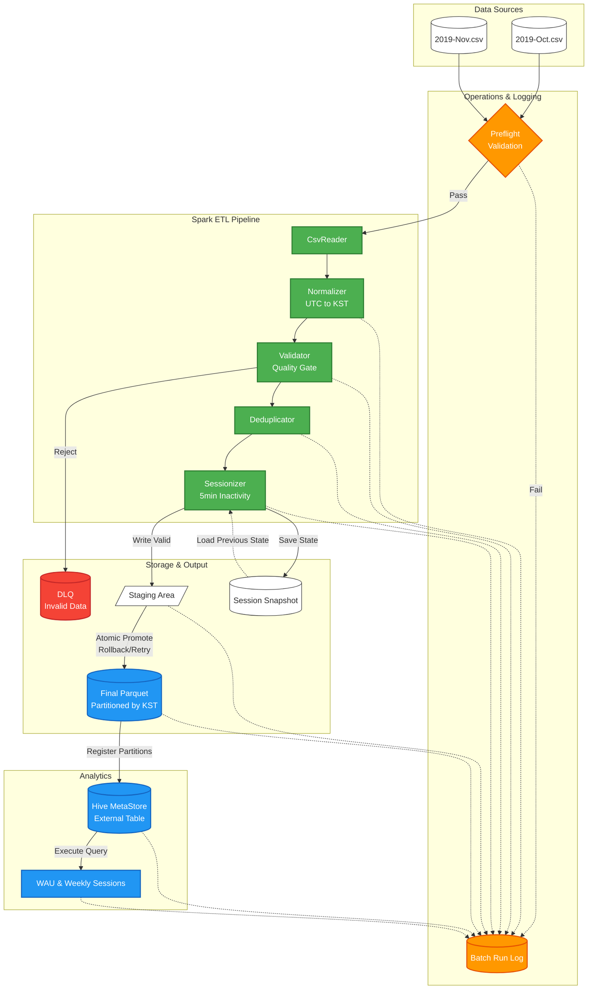

# Activity ETL & WAU

Kaggle Ecommerce Activity 로그를 Spark로 처리하여 KST 기준 parquet dataset, Hive external table, WAU 결과를 생성하는 Spark Application 과제다.

## 아키텍처 파이프라인 (Architecture Pipeline)



현재 구현 범위:

- UTC 원천 이벤트 정규화
- validation / DLQ 분리
- exact deduplication
- 5분 inactivity 기반 sessionization
- `D-1` seed + `end-date` snapshot 저장
- staging -> final promote
- promote rollback / retry
- Hive external table 생성 및 partition 등록
- WAU / weekly active sessions 실행 및 주간 aggregate 결과 저장
- preflight validation / quality gate / batch run log 기록

## 요구사항 대응

- **구현 언어**: Scala 2.12
- **Scala 선택 사유**:
  - 평소 TypeScript를 다루며 함수형 프로그래밍(FP)에 익숙한데, Scala 역시 메서드 체이닝(Method Chaining) 등 강력한 FP 패러다임을 지원하여 데이터 변환 과정을 매우 간결하고 직관적으로 작성할 수 있었다.
  - Java를 사용할 때 발생하는 불필요한 보일러플레이트 코드가 없어 전체 코드 길이가 짧아지고 유지보수를 위한 가독성이 크게 향상되었다.
  - 추가로 Spark의 네이티브 언어인 만큼 DataFrame API, Window Function, SQL DSL 등을 가장 매끄럽고 강력하게 활용할 수 있다는 점이 큰 장점으로 작용했다.
- **입력 데이터**: `2019-Oct.csv`, `2019-Nov.csv`
- **KST daily partition**: `event_date_kst`
- **세션 규칙**: 동일 `user_id` 내 `event_time` 간격이 5분 이상이면 새 `session_id` 생성
- **저장 포맷**: parquet + snappy
- **재처리 대응**: `start-date`, `end-date` 파라미터 기반 특정 날짜 범위 부분 재실행 지원
- **추가 기간 데이터 처리**: 이전 배치의 마지막 세션 상태(Snapshot)를 로드하여 새로운 기간의 데이터와 병합함으로써, 배치 경계(자정 등)에 걸친 세션도 연속적으로 분리 및 추적
- **External Table 방식**: final parquet를 Hive external table `activity_events`로 등록
- **배치 장애 복구 장치**: preflight validation, quality gate, staging -> final promote, rollback / retry, batch run log
- **WAU 계산**:
  - `user_id` 기준 WAU
  - `session_id` 기준 Weekly Active Sessions
  - 추가 기간 처리 시 전체 재집계가 아니라 영향받는 `week_start_kst` 범위만 재계산

## 실행 환경 (Tech Stack)

- **Scala**: 2.12
- **Spark**: 3.5.x (3.5.1)
- **JDK**: 17
- **SBT**: 1.10+
- **Infrastructure**: Docker Compose 기반

## 입력 데이터

프로젝트 루트 아래 `.data` 디렉터리에 배치한다.

```text
.data/
├── 2019-Oct.csv
└── 2019-Nov.csv
```

원본: [Kaggle Ecommerce Behavior Data from Multi Category Store](https://www.kaggle.com/mkechinov/ecommerce-behavior-data-from-multi-category-store)

## 0. 사전 준비 (Prerequisites)

- **설치:** [Docker Desktop](https://www.docker.com/products/docker-desktop/) 설치

## 실행 방법

기본 경로는 코드에 설정되어 있으므로 필수 파라미터만 주면 된다.

### 1. 전체 데이터셋 실행

`.data` 아래의 `2019-Oct.csv`, `2019-Nov.csv`를 함께 읽어 전체 기간을 처리하는 기본 예시다.

**Docker Compose 환경 (권장)**

```bash
docker compose up
```

**로컬 환경 (SBT가 설치된 경우)**

```bash
sbt "run --start-date 2019-10-01 \
  --end-date 2019-11-30 \
  --input-path .data \
  --run-id full_dataset_run \
  --execute-wau"
```

### 2. 특정 기간만 부분 실행

검증이나 재처리를 위해 특정 날짜 범위만 실행할 수도 있다.

예: `2019-10-01 ~ 2019-10-15`

**Docker Compose 환경 (권장)**

```bash
docker compose run spark-etl sbt "run --start-date 2019-10-01 \
  --end-date 2019-10-15 \
  --input-path .data/2019-Oct.csv \
  --run-id oct_1_15_run \
  --execute-wau"
```

**로컬 환경 (SBT가 설치된 경우)**

```bash
sbt "run --start-date 2019-10-01 \
  --end-date 2019-10-15 \
  --input-path .data/2019-Oct.csv \
  --run-id oct_1_15_run \
  --execute-wau"
```

기본값:

- `mode = daily`
- `staging-base-path = output/staging`
- `dlq-base-path = output/dlq`
- `session-state-base-path = output/session-state`
- `run-log-base-path = output/run-log`
- `output-base-path = output/final-output`
- `wau-output-base-path = output/wau-results`
- `hive-table-name = activity_events`

`--execute-wau`를 주면 Hive external table 생성, partition 등록, WAU 실행까지 함께 수행한다.
WAU 결과는 주간 aggregate dataset으로 관리되며, 이번 실행이 걸친 주차만 다시 계산한다.

## 테스트

전체 테스트:

**Docker Compose 환경 (권장):**

```bash
docker compose run spark-etl sbt test
```

**로컬 환경:**

```bash
sbt test
```

실데이터 스모크:

**Docker Compose 환경 (권장):**

```bash
docker compose run \
  -e SMOKE_SAMPLE_LIMIT=100000 \
  -e SMOKE_OUTPUT_PATH="output/smoke-output/oct-limit-100000" \
  -e HIVE_SMOKE_OUTPUT_PATH="output/smoke-output/hive-oct-limit-100000" \
  spark-etl sbt "testOnly smoke.ActivityBatchAppE2ESmokeSpec"
```

**로컬 환경:**

```bash
SMOKE_SAMPLE_LIMIT=100000 \
SMOKE_OUTPUT_PATH="output/smoke-output/oct-limit-100000" \
HIVE_SMOKE_OUTPUT_PATH="output/smoke-output/hive-oct-limit-100000" \
sbt "testOnly smoke.ActivityBatchAppE2ESmokeSpec"
```

## 주요 산출물

- staging output: `output/staging/run_id=<run_id>/valid/`
- DLQ output: `output/dlq/run_id=<run_id>/invalid/`
- final output: `output/final-output/event_date_kst=...`
- session snapshot: `output/session-state/snapshot_date_kst=<end-date>/`
- batch run log: `output/run-log/run_id=<run_id>/batch-run-log.json`
- WAU output:
  - `output/wau-results/wau-users-by-week/week_start_kst=...`
  - `output/wau-results/weekly-active-sessions-by-week/week_start_kst=...`
- WAU aggregate Hive tables:
  - `wau_users_by_week`
  - `weekly_active_sessions_by_week`

## 실제 검증 결과

실데이터 전체 기간 `2019-10-01 ~ 2019-11-30` 실행 결과:

- `input_row_count = 109,950,743`
- `validated_row_count = 109,362,687`
- `sessionized_row_count = 109,232,472`
- `unique_session_count = 22,885,344`
- `duplicate_group_count = 75,317`
- `duplicate_rows_count = 205,532`
- `dropped_duplicate_row_count = 130,215`
- `invalid_row_count = 0`
- `registered_hive_partitions_count = 61`
- output partitions: `2019-10-01 ~ 2019-11-30`

WAU 결과:

- `2019-09-30`: `818,388`
- `2019-10-07`: `1,057,958`
- `2019-10-14`: `1,090,898`
- `2019-10-21`: `1,093,146`
- `2019-10-28`: `1,054,722`
- `2019-11-04`: `1,321,141`
- `2019-11-11`: `1,543,309`
- `2019-11-18`: `1,376,755`
- `2019-11-25`: `1,133,949`

Weekly Active Sessions 결과:

- `2019-09-30`: `1,570,536`
- `2019-10-07`: `2,153,262`
- `2019-10-14`: `2,256,082`
- `2019-10-21`: `2,152,730`
- `2019-10-28`: `2,114,204`
- `2019-11-04`: `2,750,735`
- `2019-11-11`: `4,752,893`
- `2019-11-18`: `2,870,609`
- `2019-11-25`: `2,264,293`

## WAU 계산 쿼리

### 6-a. `user_id` 기준 WAU

```sql
SELECT
  week_start_kst,
  COUNT(DISTINCT user_id) AS wau_users
FROM activity_events
WHERE week_start_kst BETWEEN DATE '2019-09-30' AND DATE '2019-11-25'
GROUP BY week_start_kst
ORDER BY week_start_kst;
```

### 6-b. `session_id` 기준 Weekly Active Sessions

```sql
WITH sessions AS (
  SELECT DISTINCT
    session_id,
    session_start_week_kst AS week_start_kst
  FROM activity_events
  WHERE session_start_week_kst BETWEEN DATE '2019-09-30' AND DATE '2019-11-25'
)
SELECT
  week_start_kst,
  COUNT(*) AS weekly_active_sessions
FROM sessions
GROUP BY week_start_kst
ORDER BY week_start_kst;
```

## 운영 포인트

- `PreflightValidator`: input path, 날짜 범위, run path 충돌을 사전 검증
- `QualityGate`: `DLQ ratio > 1%` warning, `> 5%` fail
- `ActivityWriter`: staging 우선 쓰기, final promote, rollback / retry 지원
- `BatchRunLogger`: 상태 이력을 append JSON 배열로 기록
- `SessionStateStore`: `D-1` snapshot seed 사용, 처리 마지막 날 기준 snapshot 저장
- `WauQueryExecutor`: 영향받는 `week_start_kst` 범위만 읽어 주간 aggregate output과 Hive aggregate partition을 갱신

## 산출 결과 분석 (Data Insights)

1. **세션 분리 로직의 무결성 증명**: 10월 평균 WAU는 약 105만 명, 세션 수는 약 215만 개로 유저당 주 평균 2.0회 이상의 세션이 생성되었다. 이는 `5분 Inactivity` 기반 Window 함수 연산과 세션 분리 로직이 정확하게 동작함을 증명한다.
2. **이커머스 계절성 트래픽 처리 검증**: 11월 11일(광군제 시즌) 주차에는 WAU가 154만 명으로 약 50% 증가한 데 비해, 세션 수는 475만 개로 약 220% 폭증했다. 4,200만 건 이상의 대용량 트래픽 스파이크 구간에서도 파이프라인의 데이터 누락 없이 100% 처리되었다.
3. **날짜 경계 및 파티셔닝 정확도**: 첫 주차(10/01~10/06, 6일치)의 WAU(81.8만)는 온전한 주차 평균의 약 6/7 비율로 산출되었으며, 10월 내내 중복 없이 105만 명 선을 일정하게 유지했다. 이는 KST 기준 주간 그룹핑 및 멱등성 보장 로직이 완벽히 동작하고 있음을 의미한다.
